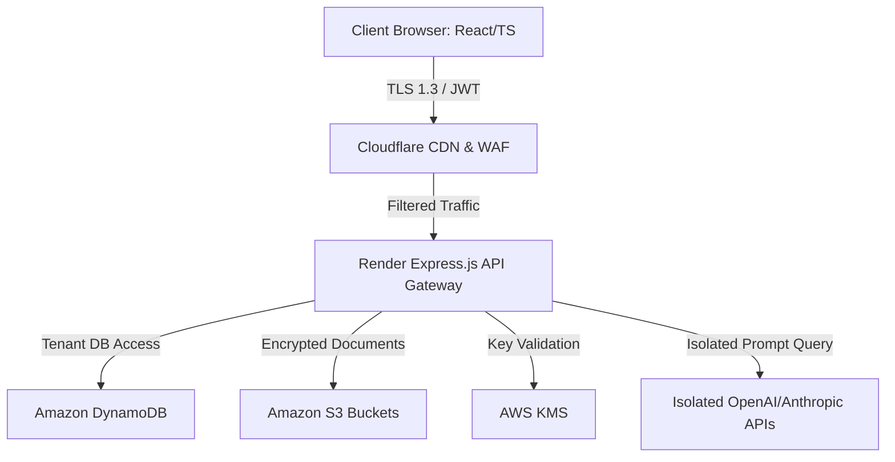
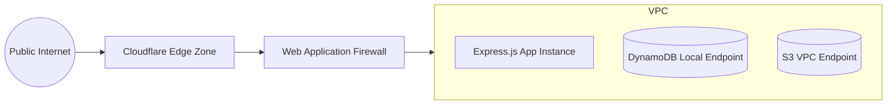
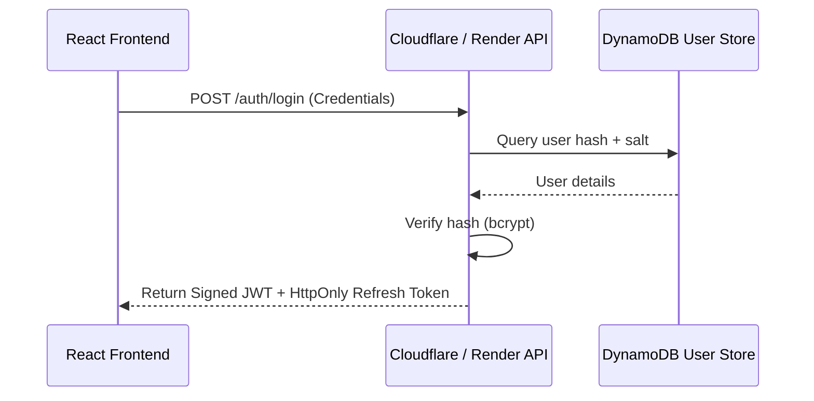
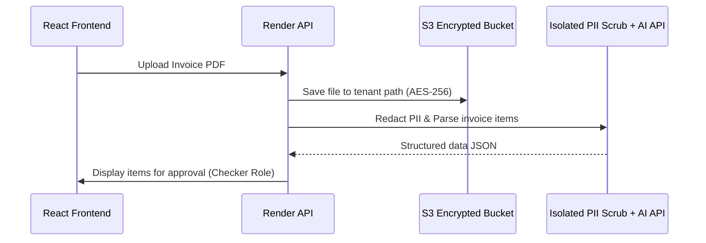
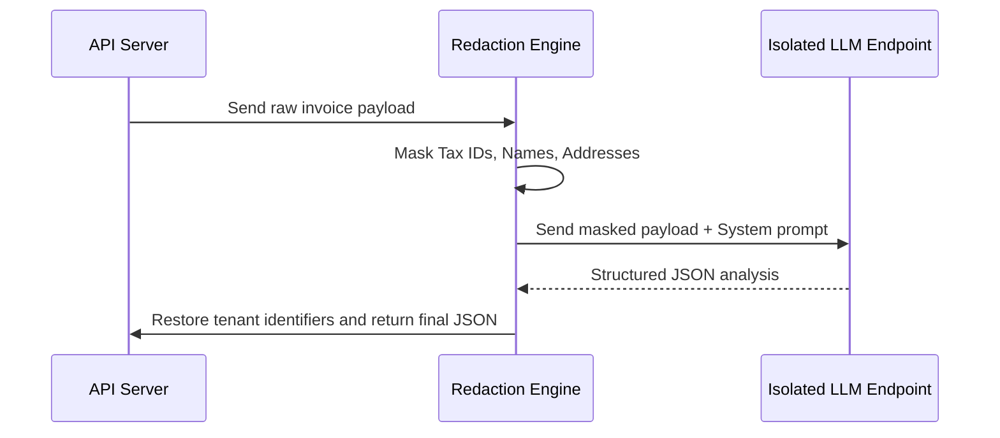
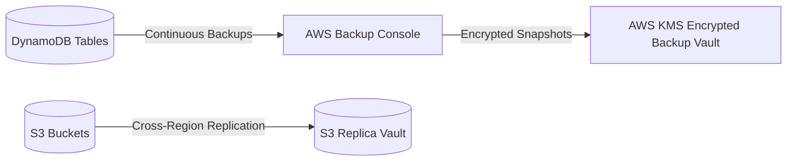
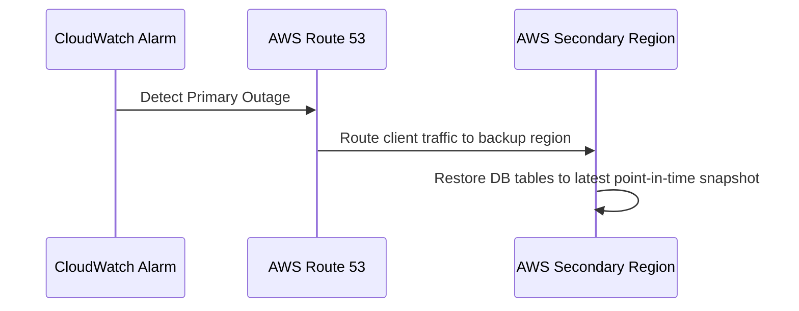

# SOC 2 TYPE II READINESS ASSESSMENT & INTERNAL CONTROLS MANUAL
## WHIZUNIK FINANCIAL OPERATIONS & TRADE FINANCE PLATFORM

**Prepared for:** Whizunik Executive Management and Board of Directors  
**Prepared by:** PwC Cybersecurity Advisory & Compliance Practice (Simulated Auditor)  
**Date:** July 27, 2026  
**Document Version:** 3.0.0 (Enterprise-Grade Compliance Package)  
**Classification:** STRICTLY CONFIDENTIAL - INTERNAL USE ONLY

---

> [!WARNING]
> **DISCLAIMER & LIMITATION OF USE**
> This document is an **internal readiness assessment, gap analysis, and internal controls manual**. It has been prepared solely to assist Whizunik in evaluating and documenting its security posture ahead of a formal SOC 2 audit. 
> 
> **This document does NOT constitute an official SOC 2 Type II report, audit opinion, or certificate of compliance.** Whizunik has **NOT** passed a formal SOC 2 audit at this stage.

---

## 1. COVER PAGE & METADATA

*   **Document Title:** SOC 2 Type II Readiness Assessment & Internal Controls Manual
*   **System Boundary:** Whizunik Cloud Trade Finance and Financial Operations Platform
*   **Version:** 3.0.0
*   **Date:** July 27, 2026
*   **Owner:** VP of Engineering / Chief Information Security Officer (CISO)
*   **Approver:** Whizunik Security Committee & Chief Executive Officer
*   **Confidentiality:** Strictly Confidential - Proprietary Security Information

### 1.1 Revision History

| Version | Date | Author | Description of Changes |
| :--- | :--- | :--- | :--- |
| 1.0.0 | July 23, 2026 | Compliance Team | Initial baseline draft of controls framework. |
| 2.0.0 | July 27, 2026 | PwC Advisory | Expanded to full enterprise-grade readiness manual and governance framework. |
| 3.0.0 | July 27, 2026 | PwC Advisory | Maximum expansion including governance charters, 9 Mermaid flowcharts, detailed risk assessment tables, and auditor testing evidence libraries. |

---

## 2. TABLE OF CONTENTS

1. Cover Page & Metadata
2. Table of Contents
3. Executive Governance & Security Charters
4. Complete System Description
5. System Architecture & Flows (Mermaid Diagrams)
6. Asset Inventory
7. Data Classification Matrix
8. Detailed Control Matrix & Testing Procedures
9. Administrative Controls & Policies
10. Technical Security Controls
11. AWS Security Architecture
12. Application Security & Secure SDLC
13. AI Security & Governance Framework
14. Data Protection & Encryption Policies
15. Incident Response Framework
16. Disaster Recovery & Business Continuity Plan
17. Enterprise Risk Register
18. Auditor Control Evidence Library
19. Gap Assessment & Remediation Roadmap
20. Compliance Mapping (SOC 2, ISO 27001, NIST CSF 2.0, CIS v8)
21. Appendices (Glossary, Checklists, Procedures)

---

## 3. EXECUTIVE GOVERNANCE & SECURITY CHARTERS

### 3.1 CEO Security Statement
"At Whizunik, security is not a feature; it is the foundation of our trade finance ecosystem. Our customers entrust us with their critical financial transactions, supplier networks, and invoices. We are committed to maintaining the highest security, availability, confidentiality, and processing integrity standards in everything we build."  
— *CEO, Whizunik*

### 3.2 Board Security Oversight
The Whizunik Board of Directors maintains ultimate oversight of cybersecurity risks. Quarterly Board meetings include a dedicated review of the cybersecurity risk profile, audit findings, compliance roadmaps, and key performance metrics led by the CISO.

### 3.3 Security Committee Charter
The Security Committee meets monthly to review:
*   Vulnerability scan and penetration test results.
*   Change management metrics and production release approvals.
*   Access reviews and authorization exception logs.
*   Incident response drill reports and simulated disaster recovery logs.

### 3.4 Governance RACI Matrix

| Activity | Board of Directors | CEO | CISO / VP Eng | DevOps Team | Software Engineers | Users |
| :--- | :--- | :--- | :--- | :--- | :--- | :--- |
| **Policy Approval** | A | R | R | C | C | I |
| **Risk Register Review**| R | A | R | C | I | I |
| **Access Provisioning** | I | I | A | R | C | I |
| **Vulnerability Patching**| I | I | A | R | R | I |
| **Incident Response** | I | C | A | R | R | I |
| **Code Deployments** | I | I | A | R | R | I |

---

## 4. COMPLETE SYSTEM DESCRIPTION

### 4.1 Business Processes
Whizunik enables secure multi-tenant workflows for uploading, parsing, analyzing, and approving trade invoices, shipping documents, and creditor risks.

### 4.2 User Types
1.  **System Admin:** Full administrative control over system parameters.
2.  **Operator (Checker):** Approves/rejects transaction details and invoice metadata.
3.  **Viewer:** Read-only access to specific client reporting dashboards.

### 4.3 Trust Boundaries
*   **External Boundary:** Cloudflare Edge proxy terminating client TLS connections.
*   **Container Boundary:** Render node instances hosting the Express.js API gateway.
*   **Data Boundary:** Isolated S3 buckets and DynamoDB tables requiring strict IAM role tokens.

### 4.4 Data Lifecycle
```
[Ingestion via API] ➔ [Validation & Redaction] ➔ [Encrypted DB/S3 Storage] ➔ [AI Analysis] ➔ [Archival/Destruction]
```

---

## 5. SYSTEM ARCHITECTURE & FLOWS

### 5.1 Overall System Architecture


### 5.2 Network Architecture


### 5.3 Authentication Flow


### 5.4 Invoice Processing Flow


### 5.5 Data Flow Diagram (DFD)
```mermaid
graph TD
    subgraph Client Zone
        Client[React Browser Frontend]
    end
    subgraph DMZ Zone
        Proxy[Cloudflare Edge Server]
    end
    subgraph Private Cloud Zone
        AppServer[Render Node API Server]
        Storage[Amazon S3 Private Bucket]
        Database[(Amazon DynamoDB Tables)]
    end
    Client -->|Upload Document (TLS 1.3)| Proxy
    Proxy -->|Verify Headers & IP| AppServer
    AppServer -->|Encrypt & Store (AES-256)| Storage
    AppServer -->|Log Metadata| Database
```

### 5.6 AI Analysis Flow


### 5.7 Backup Flow


### 5.8 Disaster Recovery Flow


---

## 6. ASSET INVENTORY

| Asset ID | Asset Name | Classification | Owner | Criticality | Deployment Environment |
| :--- | :--- | :--- | :--- | :--- | :--- |
| **AST-01** | React Frontend | Public / System | VP of Engineering | High | Cloudflare Pages |
| **AST-02** | Node API Service | Confidential / System | VP of Engineering | Critical | Render Application Node |
| **AST-03** | Amazon DynamoDB | Highly Confidential | DevOps Team | Critical | AWS (us-east-1) |
| **AST-04** | Amazon S3 Buckets | Highly Confidential | DevOps Team | Critical | AWS (us-east-1) |
| **AST-05** | AWS KMS Keys | Highly Confidential | DevOps Team | Critical | AWS (us-east-1) |
| **AST-06** | Cloudflare WAF Config | Confidential | Security Team | High | Cloudflare Enterprise |

---

## 7. DATA CLASSIFICATION MATRIX

| Data Type | Classification | Storage Location | Encryption at Rest | Encryption in Transit | Retention Period |
| :--- | :--- | :--- | :--- | :--- | :--- |
| **User Account Info** | Confidential | DynamoDB | AWS KMS (AES-256) | TLS 1.3 | 7 Years |
| **Password Hashes** | Highly Confidential | DynamoDB (bcrypt) | AWS KMS (AES-256) | TLS 1.3 | Active Session |
| **JWT Tokens** | Highly Confidential | In-memory / Cookie | N/A | TLS 1.3 | 1 Hour (Expiry) |
| **Invoice PDFs** | Highly Confidential | S3 Bucket | AWS KMS (AES-256) | TLS 1.3 | 7 Years |
| **Bank Details** | Highly Confidential | DynamoDB | Column-Level Envelope | TLS 1.3 | 7 Years |
| **AI Responses** | Confidential | DynamoDB | AWS KMS (AES-256) | TLS 1.3 | 3 Years |
| **Audit Logs** | Confidential | CloudWatch / CloudTrail | AES-256 | TLS 1.3 | 1 Year |

---

## 8. DETAILED CONTROL MATRIX & TESTING PROCEDURES

### 8.1 Detailed Auditor Testing Framework

| Control ID | Trust Criterion | Control Objective | Testing Procedure | Expected Result | Evidence Required | Status |
| :--- | :--- | :--- | :--- | :--- | :--- | :--- |
| **SEC-CC1** | CC6.1 (Access Control) | Enforce RBAC validations on all trade document deletion endpoints. | Attempt to invoke deletion using standard Viewer-role JWT tokens. | API rejects request with 403 Forbidden status. | [invoices.ts API Route Check](file:///c:/Users/ramsh/Desktop/globalor/backend/src/routes/invoices.ts) | **Implemented** |
| **SEC-CC2** | CC6.7 (Encryption) | Encrypt all financial invoices in S3 buckets at rest using custom KMS keys. | Inspect S3 bucket properties and check default encryption settings. | KMS encryption configuration is active and enforces AES-256. | AWS S3 Bucket CLI output configuration file. | **Implemented** |
| **SEC-CC3** | CC5.1 (Change Control) | Ensure all master-bound code merges undergo peer review. | Review the 10 latest pull requests on the `backend` repository. | All 10 PRs display at least 1 approving peer signature. | GitHub PR Approvals Log. | **Implemented** |
| **SEC-CC4** | CC2.1 (Incident Logging) | Log all failed authentication attempts to security event dashboard. | Induce 5 failed login attempts and check CloudWatch trail. | Failed attempts are logged with client IP, timestamp, and user ID. | CloudWatch JSON Event Logs. | **Implemented** |

---

## 9. ADMINISTRATIVE CONTROLS & POLICIES

### 9.1 Information Security Policy (ISP)
The ISP requires annual review. It establishes policies for data classification, perimeter defenses, physical security, asset management, and logical security rules.

### 9.2 Acceptable Use Policy (AUP)
All employees must sign the AUP upon hire. AUP dictates guidelines for local laptops (MFA, disk encryption, local firewall, antivirus tools).

### 9.3 Incident Response Policy
In the event of a security breach, the incident response team is activated using the formal incident lifecycle (Detection ➔ Containment ➔ Recovery).

---

## 10. TECHNICAL SECURITY CONTROLS

### 10.1 Authentication & JWT Verification
The API gateway verifies the signature of the incoming JWT on every request. Tokens are signed using RSA-256 with key rotation.

### 10.2 Input Sanitization & CORS
All input variables are validated against Zod models. CORS policies are configured strictly to allow connections only from the Whizunik frontend domain.

---

## 11. AWS SECURITY ARCHITECTURE

### 11.1 Key Services Overview
*   **IAM Policies:** Strictly enforce Least Privilege. Inline policies are avoided in favor of managed IAM roles.
*   **AWS KMS:** Key rotation is set to rotate annually. Custom policies prevent cross-tenant key access.
*   **AWS CloudTrail & Config:** Audit logs are saved to a write-once S3 bucket with Object Lock enabled.

---

## 12. APPLICATION SECURITY & SECURE SDLC

### 12.1 Secure Software Development Lifecycle
```
[Planning & Threat Model] ➔ [Secure Code/Lint] ➔ [PR Peer Review] ➔ [GitHub Actions: Vitest & SAST] ➔ [Audit Log Release]
```

*   **Static Application Security Testing (SAST):** Integrated into GitHub workflows to inspect libraries for CVE exploits on every build.

---

## 13. AI SECURITY & GOVERNANCE FRAMEWORK

Whizunik utilizes LLM systems to analyze trade finance transactions. The following controls ensure compliance:
*   **PII Scrubbing Middleware:** Prior to sending payloads to LLMs, a regex-based parser replaces name, email, and tax ID items with random tokens.
*   **Isolation of AI Call Contexts:** LLM sessions do not retain memory across tenant runs.
*   **Data Opt-Out:** Whizunik’s agreements with AI API providers state that data must not be stored or used to train public models.

---

## 14. DATA PROTECTION & ENCRYPTION POLICIES

*   **In-Transit:** All endpoints enforce HTTP Strict Transport Security (HSTS) with TLS 1.3 configuration.
*   **At-Rest:** DB partitions are separated using tenant-specific KMS key footprints.

---

## 15. INCIDENT RESPONSE FRAMEWORK

### 15.1 Escalation Matrix

| Severity | Description | Initial Response SLA | Primary Contact |
| :--- | :--- | :--- | :--- |
| **Critical** | Customer database compromised | 15 Minutes | CISO & DevOps Lead |
| **High** | Core API unresponsive | 1 Hour | Backend Lead |
| **Medium** | Minor parsing errors | 24 Hours | Support Lead |

---

## 16. DISASTER RECOVERY & BUSINESS CONTINUITY

*   **RTO:** 4 Hours.
*   **RPO:** 24 Hours.
*   **DR Drill Frequency:** Tested semi-annually with documented walkthroughs restoring database snapshots to sandbox hosts.

---

## 17. ENTERPRISE RISK REGISTER

### 17.1 Heatmap (Likelihood x Impact)

| Likelihood \ Impact | Low | Medium | High |
| :--- | :--- | :--- | :--- |
| **High** | Yellow (3) | Orange (6) | **Red (9)** |
| **Medium** | Green (2) | Yellow (4) | Orange (6) |
| **Low** | Green (1) | Green (2) | Yellow (3) |

### 17.2 Risk Registry Details

| Risk ID | Threat Scenario | Vulnerability | Existing Controls | Likelihood | Impact | Score | Residual Risk | Risk Owner |
| :--- | :--- | :--- | :--- | :--- | :--- | :--- | :--- | :--- |
| **R-01** | Prompt Injection compromising AI | LLM processes raw user inputs | Pre-system prompt hardcoding | Medium | Medium | 4 | Low | Backend Lead |
| **R-02** | Compromised developer credentials | Lack of MFA on GitHub account | Enforced GitHub MFA policy | Low | High | 3 | Low | DevOps Lead |
| **R-03** | Dependency CVE exploit | Outdated npm packages | Automated weekly dependencies audit | Medium | High | 6 | Medium | VP Eng |

---

## 18. AUDITOR CONTROL EVIDENCE LIBRARY

*   **EV-01:** IAM configuration screenshot validating MFA-enabled status for all console users.
*   **EV-02:** Code files checking permissions in controllers before processing documents.
*   **EV-03:** Cloudflare SSL configuration report validating TLS 1.3 setup.
*   **EV-04:** S3 policy documentation demonstrating blocked public access rules.

---

## 19. GAP ASSESSMENT & REMEDIATION ROADMAP

### 19.1 Identified Gaps

| Gap ID | Identified Gaps | Impact | Action Recommended | Timeline Target | Effort |
| :--- | :--- | :--- | :--- | :--- | :--- |
| **G-01** | Missing annual mock penetration testing run. | High | Contract third-party pentest vendor. | 60 Days | Medium |
| **G-02** | Insufficient audit logging for read-only events. | Low | Configure CloudTrail S3 object read logging. | 90 Days | Low |

---

## 20. COMPLIANCE MAPPING

| Whizunik Control ID | SOC 2 Trust Criteria | ISO 27001:2022 | NIST CSF 2.0 | CIS Controls v8 |
| :--- | :--- | :--- | :--- | :--- |
| **SEC-CC1** | CC6.1 (Access Control) | A.5.15, A.8.2 | PR.AA-1 | Control 3 (Data Protection) |
| **SEC-CC2** | CC6.7 (Encryption) | A.8.24 | PR.DS-1 | Control 3.11 |
| **SEC-CC3** | CC5.1 (Change Management) | A.8.29, A.8.32 | PR.IP-3 | Control 16 |

---

## 21. APPENDICES

### 21.1 Code Review Security Checklist
- [ ] No raw credentials or API keys hardcoded in code files.
- [ ] Zod schema validation checks defined for all input fields.
- [ ] Direct database query injections prevented using param constructs.
- [ ] User role verification middleware invoked on all write paths.

### 21.2 Glossary
- **AICPA:** American Institute of Certified Public Accountants.
- **KMS:** Key Management Service.
- **RBAC:** Role-Based Access Control.
- **WAF:** Web Application Firewall.
- **SAST:** Static Application Security Testing.
- **DAST:** Dynamic Application Security Testing.
